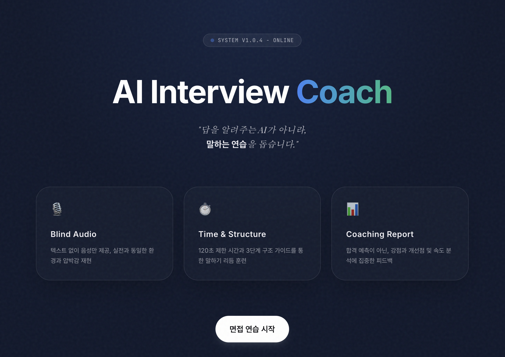
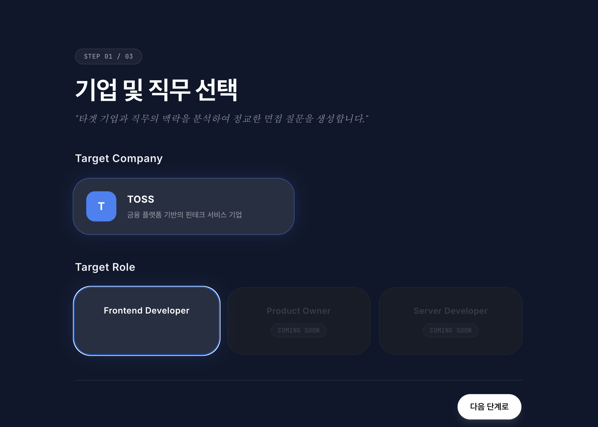
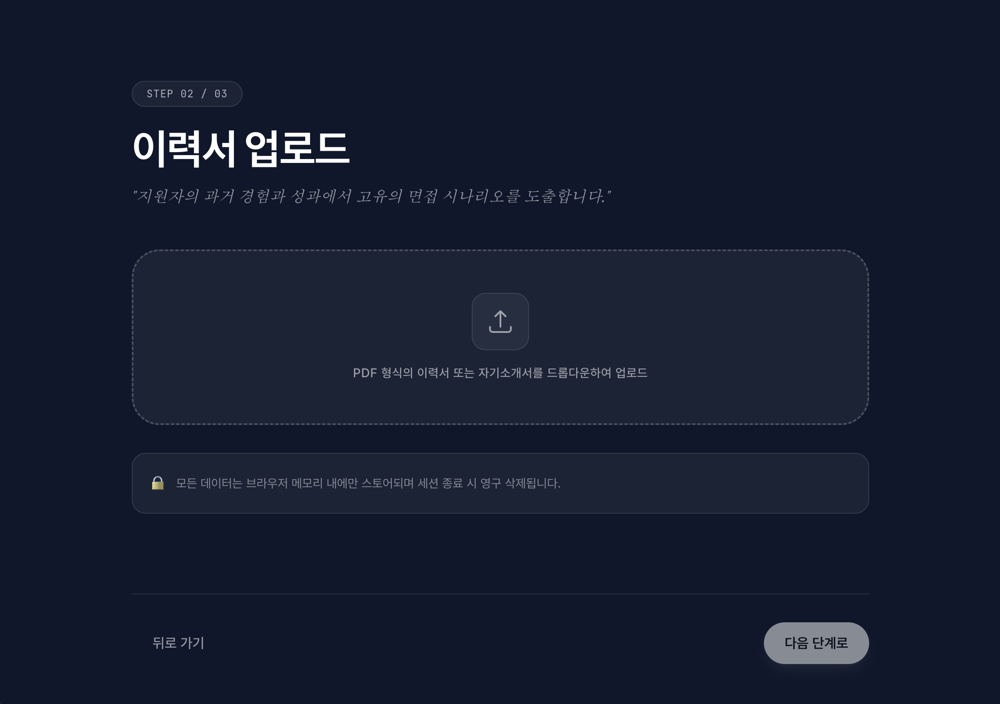
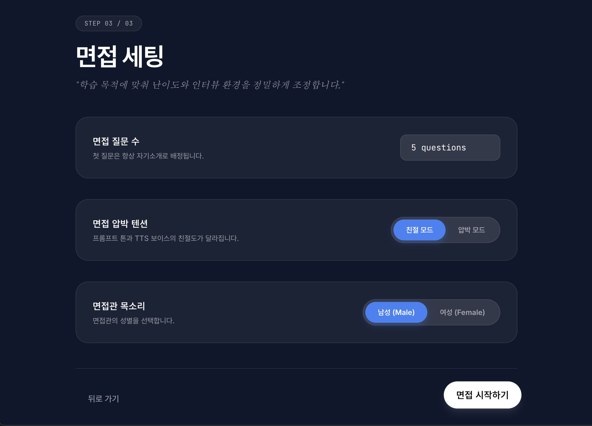
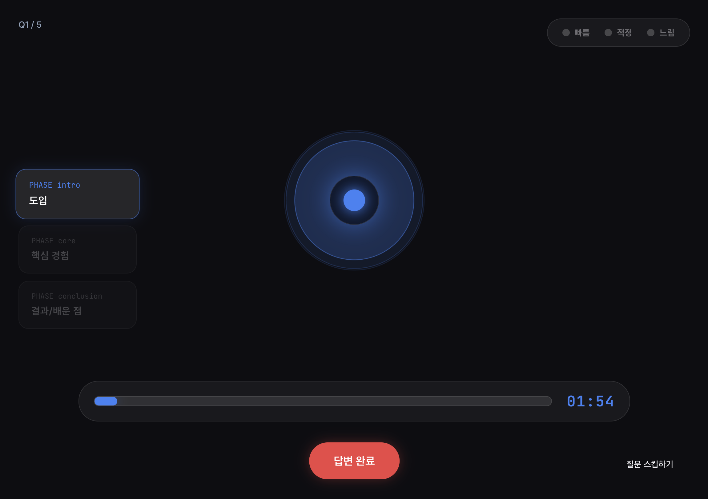
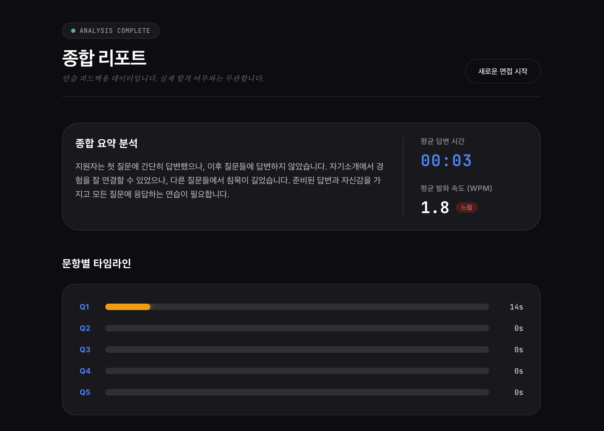
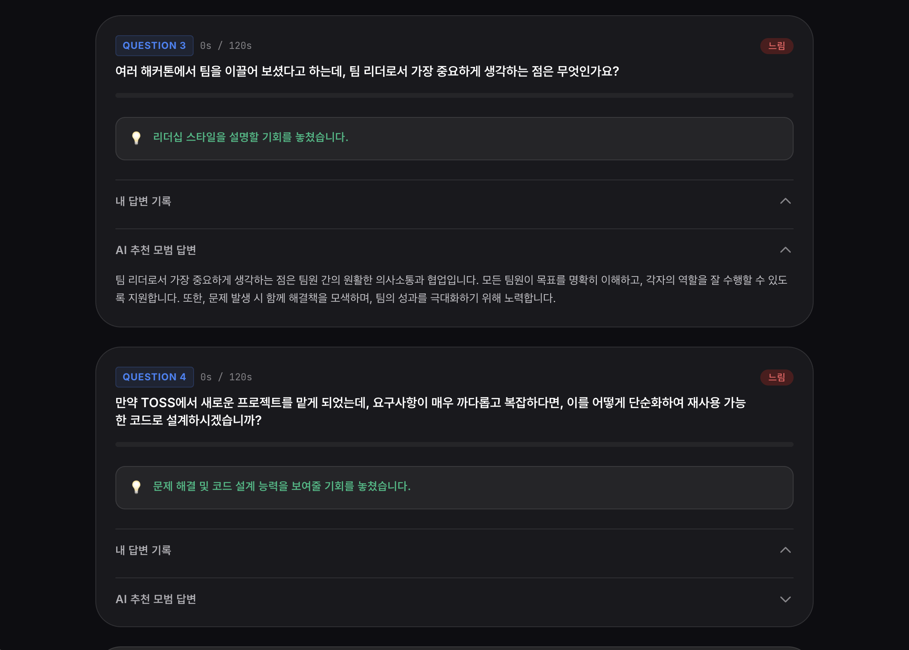

# AI Interview Coach

실전 면접 감각을 훈련하는 AI 기반 면접 연습 서비스

> "답을 알려주는 AI가 아니라, 말하는 연습을 돕습니다"

## Demo

**Live**: [frontend-phi-sand-33.vercel.app](https://frontend-phi-sand-33.vercel.app)

## Screenshots



<br/>

### Setup Flow

<table>
  <tr>
    <td align="center"><b>기업 · 직무 선택</b></td>
    <td align="center"><b>이력서 업로드</b></td>
    <td align="center"><b>면접 세팅</b></td>
  </tr>
  <tr>
    <td></td>
    <td></td>
    <td></td>
  </tr>
</table>

<br/>

### Interview & Report



<table>
  <tr>
    <td align="center"><b>종합 리포트</b></td>
    <td align="center"><b>문항별 AI 피드백</b></td>
  </tr>
  <tr>
    <td></td>
    <td></td>
  </tr>
</table>

## Features

- **Blind Audio Interview** - 질문 텍스트 없이 음성만 제공, 실제 면접 상황 재현
- **Time & Structure Trainer** - 답변 시간 120초 고정 + 구조 가이드 (도입/핵심경험/결과)
- **Pressure Mode** - 친절/압박 스타일 전환으로 실전 긴장감 재현
- **Resume-Context Fit** - 이력서 + 기업/직무 맥락 기반 개인화 질문 생성
- **No Score, Coaching** - 합불/점수 없이 훈련 피드백에 집중

## Service Flow

```
Landing → 기업/직무 선택 → 이력서 업로드(PDF) → 면접 설정
    → 실전 면접 (TTS 질문 → 음성 답변 → STT) → 분석 리포트
```

| Page | Route | Description |
|------|-------|-------------|
| Landing | `/` | 서비스 소개 + CTA |
| 기업/직무 선택 | `/setup/company` | 기업 카드 + 직무 선택 |
| 이력서 업로드 | `/setup/resume` | PDF 업로드 + 텍스트 추출 |
| 면접 설정 | `/setup/config` | 질문 수 / 스타일 / 목소리 설정 |
| 면접 진행 | `/interview` | TTS 질문 + 마이크 녹음 + 타이머 |
| 면접 종료 | `/interview/complete` | 분석 대기 |
| 리포트 | `/report` | 결과 시각화 |

## Tech Stack

| Layer | Technology |
|-------|-----------|
| Framework | React 19 + TypeScript |
| Build | Vite 7 |
| Styling | Tailwind CSS 4 (dark theme) |
| State | Zustand |
| Routing | React Router v7 |
| PDF Parsing | pdfjs-dist |
| AI | OpenAI GPT-4o (질문/리포트 생성) |
| TTS | OpenAI TTS API (면접관 음성) |
| STT | OpenAI Whisper API (답변 텍스트 변환) |
| Deploy | Vercel |

## Getting Started

### Prerequisites

- Node.js 18+
- OpenAI API Key ([platform.openai.com](https://platform.openai.com/api-keys))

### Installation

```bash
git clone <repository-url>
cd frontend
npm install
```

### Environment Variables

```bash
cp .env.example .env
```

`.env` 파일에 OpenAI API 키를 설정:

```
VITE_OPENAI_API_KEY=sk-your-api-key-here
```

### Development

```bash
npm run dev
```

`http://localhost:5173` 에서 확인

### Build

```bash
npm run build
npm run preview
```

## Project Structure

```
src/
├── config/          # 환경변수 타입 접근
├── types/           # TypeScript 인터페이스
├── data/            # 기업 데이터 (하드코딩)
├── stores/          # Zustand 상태 관리
│   ├── useSessionStore.ts
│   ├── useInterviewStore.ts
│   └── useReportStore.ts
├── services/        # API Facade + OpenAI 서비스
│   ├── api.ts       # Facade (백엔드 전환 시 이 파일만 수정)
│   └── openai/      # GPT, TTS, STT, Report
├── hooks/           # Custom hooks
├── lib/             # 유틸리티 (WPM 계산, 구조 가이드, 시간 포맷)
├── components/
│   ├── ui/          # Button, Card, Select, Toggle 등
│   ├── layout/      # PageContainer, StepIndicator
│   ├── interview/   # 면접 UI (타이머, 구조가이드, 속도신호)
│   └── report/      # 리포트 UI (요약, 차트, 분석카드)
├── pages/           # 7개 페이지 컴포넌트
├── router.tsx       # 라우트 정의 + 가드
└── main.tsx         # 엔트리포인트
```

## Architecture

### API Facade Pattern

`src/services/api.ts`가 유일한 API 접점. 백엔드 준비 시 이 파일 내부만 `fetch('/api/...')`로 교체하면 됨.

```
Frontend → api.ts (Facade) → openai/* (현재: 직접 호출)
                             → fetch('/api/...') (향후: 백엔드 경유)
```

### TTS Pre-generation

면접 시작 시 모든 질문의 TTS를 `Promise.all`로 병렬 생성하여 면접 중 지연 없음.

### Korean WPM Calculation

한글 음절 블록 수 / 2.5 = 근사 단어 수
빠름: >180 WPM | 적정: 120-180 | 느림: <120

## Team

GDG on Campus 해커톤 프로젝트

| Role | Stack |
|------|-------|
| Frontend | React + TypeScript |
| Backend | Python FastAPI |

## License

This project is for educational/hackathon purposes.
